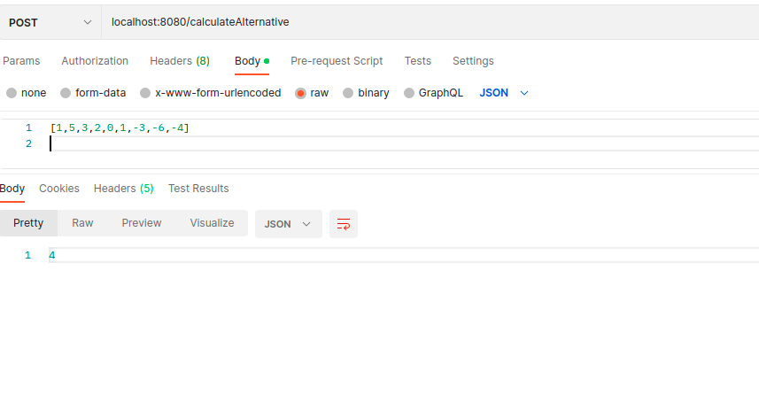

# Endpoints
* GET /calculate/{array} endpoint accepts an array of integers, then calculates the missing positive integer from the array and returns it.

Example 1: *http://localhost:8080/calculate/1,5,3,2,0,1,-3,-6,-4*

Returns 4.

Example 2: *http://localhost:8080/calculate/5,1,0,4,10,6,-3,-2* 

Returns 2

* POST /calculateAlternative/ accepts an array in [] format as the POST body. It returns the missing positive integer. 

Example 1:

Returns 4 just as the first GET request.

Example 2: 

Returns 2 just as the second GET request.

There are two tests with MockMVC to the GET endpoints in the test folder.

# ToDo

- Write two MockMVC tests for the POST endpoint
- Add demo to Heroku