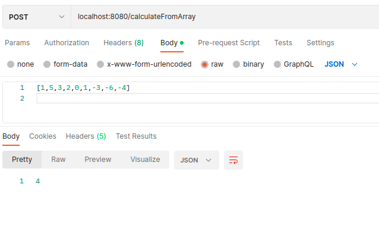
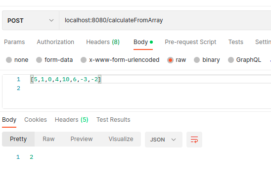

# Endpoints
* GET **/calculateFromArray/{array}** endpoint accepts an array of integers, then calculates the missing positive integer from the array and returns it.

Example 1: *http://localhost:8080/calculateFromArray/1,5,3,2,0,1,-3,-6,-4*

Returns 4.

Example 2: *http://localhost:8080/calculateFromArray/5,1,0,4,10,6,-3,-2* 

Returns 2

* POST **/calculateFromArray/** accepts an array of integers in [] format as the POST body. It returns the missing positive integer.

Example 1:

Returns 4 just as the first GET request.

Example 2: 

Returns 2 just as the second GET request.

There are two tests with MockMVC to the GET endpoint in the test folder.

There are three tests with MockMVC to the POST endpoint in the test folder.

## ToDo

- ~~Add GET/POST tests~~
- ~~Make it so app supports array with integers bigger than 999~~
- ~~Logic is duplicated for GET and POST request. Place logic in a separate Class.~~
- ~~Deploy to Heroku or Netlify~~ Heroku deployment failed with 3 different SDKs, Netlify doesn't support Java Spring Boot
- Deploy to AWS Cloud
